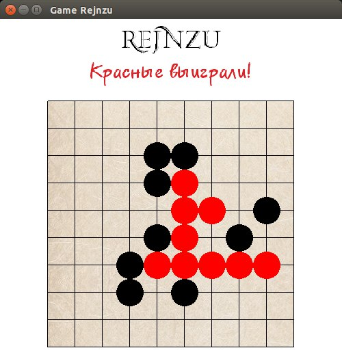
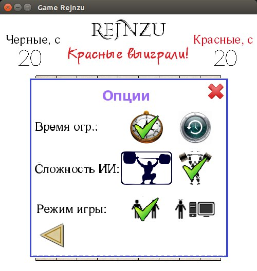

# renju

Аналог игры Рейндзю. Спортивный вариант крестиков-ноликов по 5 в ряд.




## Установка и запуск

Для установки клонируйте репозиторий и соберите проект с помощью `stack`:

```
git clone https://github.com/cmc-haskell-2016/renju.git
cd renju
stack setup
stack build
```

После установки запуск осуществляется командой `stack exec`:

```
stack exec renju
```

